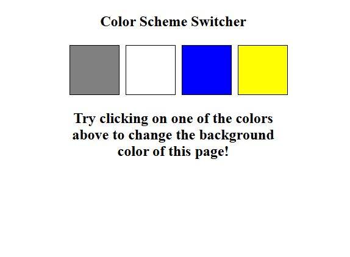
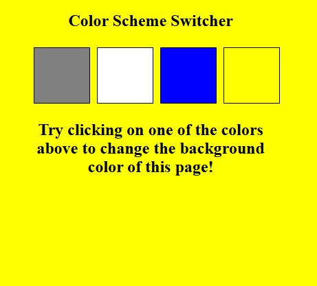
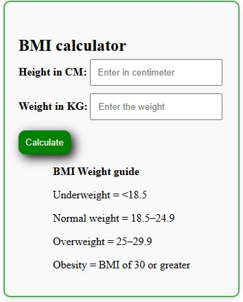
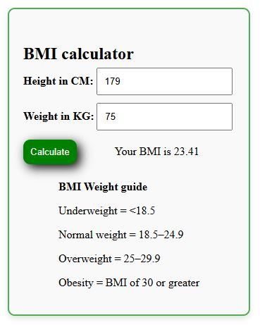

# MINI JAVASCRIPT PROJECTS

## PROJECTS INCLUDE

**1. Project One - color Changer 🔥**

_A simple HTML and Javascript project to change the color of the background once the button is clicked_ 

**2. Project Two - BMI calculator ♎**

_A simple HTML and Javascript project to calculate the BMI of the user it takes input from the user and returns the calulated BMI_ 

