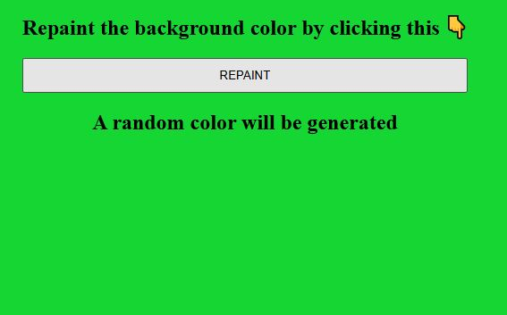

# MINI JAVASCRIPT PROJECTS

## PROJECTS INCLUDE

**1. Project One - color Changer 🔥**

_A simple HTML CSS and Javascript project to change the color of the background once the button is clicked_ 

**2. Project Two - BMI calculator ♎**

_A simple HTML CSS and Javascript project to calculate the BMI of the user it takes input from the user and returns the calulated BMI_ 

**3. Project Three - Digital Clock ⏰**

_A simple HTML CSS and Javascript project to display the current time_ 

**4. Project Four - Guess the Number ✌**

_A simple HTML CSS and Javascript project to guess the number with users previous guesses displayed_ 

**5. Project Five - Repaint Random 🎨**

_A simple HTML CSS and Javascript project to repaint the background using randomly generated hexavalue colors_ 

